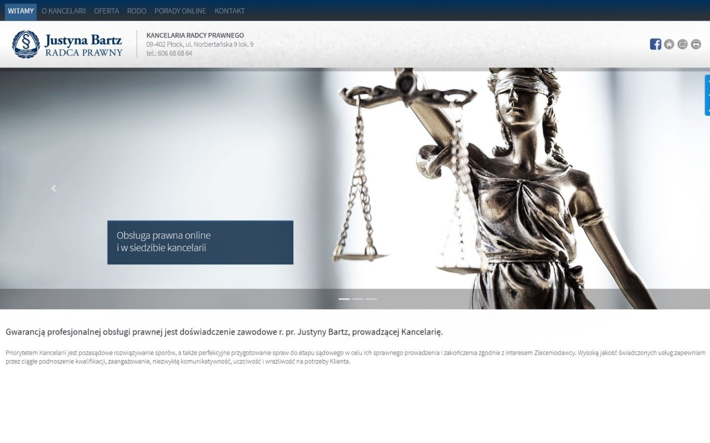
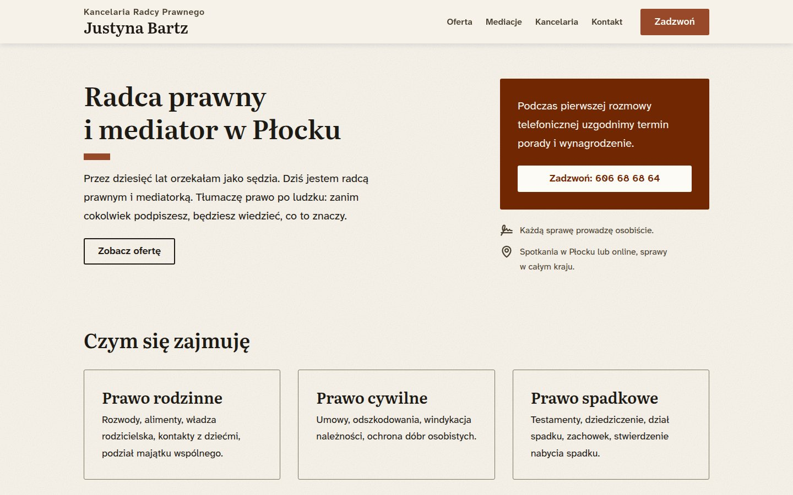

**English** · [Polski](README.pl.md)

# bartz-kancelaria.pl

A website for a one-person law practice in Płock, Poland. Designed, built and
looked after by Witold Woźniak.

**[bartz-kancelaria.pl →](https://bartz-kancelaria.pl)**

| June 2025 | October 2026 |
| --- | --- |
|  |  |

## The brief

The client is my mother. Justyna Bartz is a radca prawny (a Polish legal
counsel) and a mediator on the Płock regional court's list. She was a judge
for ten years before opening her own practice in 2008.

The site has two readers:

- **Someone in trouble.** A divorce, a death in the family, a dispute. Often
  it's their first time with a lawyer, and they're reading on a phone in the
  evening. The site's one job is to get them to call or write.
- **An institution** checking her out before signing a contract. It needs to
  see a serious practice.

She threw out my first headline as "more life coach than lawyer", and she was
right: not one word of it could be checked. That set the rule for every
sentence on the site: it stays only if you can check that it's true. No
slogans, no promised outcomes. The profession's ethics rules ask for the same.

## What came out of it

- **No JavaScript.** Twenty pages of plain HTML and one stylesheet. Nothing to
  load, nothing to break, nothing to track.
- **Readable for everyone.** Text contrast meets WCAG AAA (7:1). Every page
  gets an automated accessibility scan on every push, and a failure turns the
  build red.
- **Her mediation paperwork, online.** The eight documents she uses in
  mediation, each as a web page with a filled-in example and a print-ready PDF
  made from the same text. Four of the PDFs are forms you can fill in on a
  computer.
- **No cookies, no tracking.** The fonts are self-hosted, and the map is drawn
  from OpenStreetMap data and served as a plain image, so no visitor data goes
  to Google. Her privacy page can say so truthfully.
- **Light.** About 300 kB per page, most of it the two typefaces.
- **Cheap to look after.** For a content change I don't need to open the code:
  I tell an AI agent what to change, the tests check it, and it's done. A new
  price or phone number takes seconds of my time.
