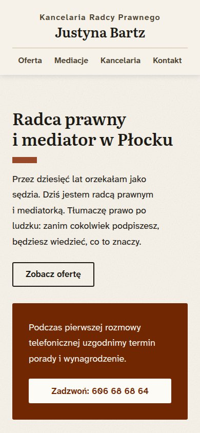

[English](README.md) · **Polski**

# bartz-kancelaria.pl

Strona internetowa Kancelarii Radcy Prawnego Justyny Bartz, jednoosobowej
kancelarii w Płocku. Projekt, wykonanie i utrzymanie: Witold Woźniak.

**[bartz-kancelaria.pl →](https://bartz-kancelaria.pl)**

| Czerwiec 2025 | Październik 2026 |
| --- | --- |
|  |  |

## Zadanie

Klientką jest moja mama, Justyna Bartz: radca prawny i stała mediatorka z listy
Prezesa Sądu Okręgowego w Płocku. Przez dziesięć lat orzekała jako sędzia, a od
2008 roku prowadzi własną kancelarię.

Strona ma dwóch odbiorców:

- **Klient indywidualny**, często pierwszy raz u prawnika, w sprawie rozwodu,
  spadku albo sporu, zwykle czytający na telefonie. Strona ma mu ułatwić
  telefon albo wiadomość.
- **Instytucja**, która sprawdza kancelarię przed podpisaniem umowy. Dla niej
  strona ma przedstawić wiarygodną, profesjonalną kancelarię.

Każde zdanie na stronie musi dać się sprawdzić. Strona nie obiecuje wyników
i nie używa haseł reklamowych, zgodnie z zasadami etyki radcy prawnego.

## Rezultaty

- **Bez JavaScriptu.** Dwadzieścia stron statycznego HTML-a i jeden arkusz
  stylów.
- **Dostępność.** Kontrast tekstu spełnia WCAG AAA (7:1).
- **Dokumenty mediacyjne.** Osiem dokumentów używanych w jej mediacjach. Każdy
  jest opublikowany jako strona z wypełnionym przykładem i jako PDF do druku,
  generowany z tego samego źródła. Cztery z tych PDF-ów to formularze do
  wypełnienia na komputerze.
- **Prywatność.** Bez ciasteczek i bez śledzenia. Czcionki są serwowane razem
  ze stroną, a mapa jest narysowana z danych OpenStreetMap i podana jako
  statyczny obraz. Strony nie pobierają niczego z innych domen.
- **Waga.** Około 300 kB na stronę, w większości czcionki.
- **Testy.** Przy każdej zmianie zestaw testów end-to-end sprawdza wszystkie
  dwadzieścia stron: dostępność, treść, nawigację, metadane SEO i pliki PDF.
- **Utrzymanie.** Klientka nie chciała sama zarządzać stroną, więc nie ma
  panelu administracyjnego; stronę utrzymuję ja. Zmiany treści nie wymagają
  otwierania kodu: edycję wprowadza agent AI, a testy ją weryfikują. Zmiana
  numeru telefonu czy jednego zdania zajmuje kilka sekund.

## Przebieg

- **Punkt wyjścia.** Poprzednią stronę (wyżej, czerwiec 2025) wykonała inna
  firma, w pakiecie z abonamentem na hosting i utrzymanie, który kosztował
  więcej, niż strona wymagała. Zaproponowałem nowy projekt i rezygnację z tego
  abonamentu.
- **Brief.** Wywiad projektowy w lipcu 2026 roku określił dwóch odbiorców, ton
  i listę rzeczy, których na stronie nie będzie: Temidy, młotków, zdjęć
  stockowych, obietnic wyniku ani wyskakujących okien.
- **Projekt i teksty.** Klientka dała mi pełną swobodę w projekcie
  i w większości tekstów. Jej własne teksty ze starej strony zostały, poprawiona jest tylko
  typografia.
- **Akceptacja.** Nowe teksty omówiliśmy zdanie po zdaniu. Ostateczne
  brzmienie, z jej poprawkami, zatwierdziła we wrześniu 2026 roku. Do tego
  czasu podgląd strony był dostępny tylko po zalogowaniu.
- **Hosting.** Strona tymczasowo działa bezpłatnie na Cloudflare Pages.
  Domena, hosting i poczta przechodzą do jednego dostawcy, tańszego i z lepszym
  wsparciem.

## Decyzje techniczne

- **Astro zamiast Nuxta.** Pierwsza wersja, którą zbudowałem, działała na
  Nuxcie. Zmierzona na wyniku builda, wysyłała 320 kB JavaScriptu (po
  kompresji gzip) przy każdym wczytaniu strony. Jedynym interaktywnym
  elementem było menu na telefonie, a nowy projekt usunął i to. Pierwotny plan
  zakładał pozostanie przy Nuxcie; pomiary go zmieniły. Wersja na Astro nie
  wysyła JavaScriptu, ma 5 zależności produkcyjnych zamiast 17 i buduje się
  w niecałą sekundę.
- **Spisany system projektowy.** Każdy kolor, rozmiar i odstęp pochodzi
  z jednego arkusza tokenów. Kolory tekstu dobrano tak, by osiągały kontrast
  7:1 na jedynym tle strony, więc kontrast nie może przejść na jednej
  powierzchni, a nie przejść na innej.
- **Jedno źródło dla każdego dokumentu.** Każdy dokument mediacyjny to plik
  Markdown z własnymi znacznikami formularza (pole, kratka, podpis),
  renderowanymi przez niewielką wtyczkę Markdown. PDF drukuje ze strony
  Chromium w trybie headless. W formularzach do wypełnienia skrypt mierzy,
  gdzie każde puste pole wypadło w wydrukowanym PDF-ie, i dokładnie tam
  umieszcza pole formularza. Każdy PDF zapisuje skrót (hash) swojego źródła,
  a CI nie przechodzi, jeśli dokument zmieniono, a PDF-u nie wygenerowano od
  nowa.
- **Testy, które potrafią nie przejść.** axe-core skanuje każdą stronę. Cele
  dotykowe są mierzone względem minimum 48 px. Test PDF-ów sprawdza
  w emulacji druku, że żaden przykładowy tekst nie trafia na papier. Lista
  adresów jest pisana ręcznie, więc strona, która przestanie się renderować,
  nie wypadnie po cichu z testów. Po każdej zmianie bramki dostępności jest
  ona celowo psuta, żeby sprawdzić, że nadal zgłasza błąd.
- **Prywatność wbudowana w konstrukcję.** Czcionki są serwowane ze strony.
  Mapę rysuje skrypt w Pythonie z danych OpenStreetMap do pliku SVG, który po
  kompresji gzip waży 14 kB, a podpisy na niej to zwykły tekst HTML. Polityka
  bezpieczeństwa treści (CSP) to `default-src 'none'`, bez żadnego źródła
  skryptów. Statyczna mapa Google odpadła, bo jej warunki wymagają ładowania
  jej z serwerów Google w przeglądarce odwiedzającego.
- **Repozytorium, w którym może pracować agent AI.** Konwencje są spisane dla
  agenta. Zmienne dane są w jednym pliku, a teksty w Markdownie, więc rutynowe
  zmiany trafiają w przewidywalne miejsca, a testy wyłapują błędy.

**Stos:** Astro 7 · Tailwind CSS v4 · TypeScript · Playwright + axe-core ·
Biome · Bun · GitHub Actions · Cloudflare Pages

Kod źródłowy jest prywatny.

## Kontakt

Witold Woźniak

- E-mail: [witold@witoldwozniak.dev](mailto:witold@witoldwozniak.dev)
- LinkedIn: [linkedin.com/in/witold-wozniak](https://www.linkedin.com/in/witold-wozniak/)
